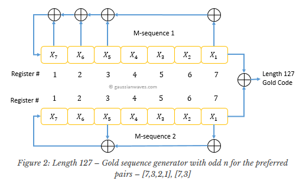
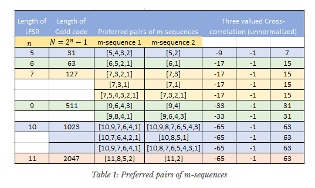

## Definicija zadatka

## Podjela zadataka u nekoliko koraka

## Goldov kod i skripta
Goldov kod je vrsta ortogonalnog koda koji se zbog svojih svojstava često koristi u telekomunikacijama (CDMA)
i satelitskoj navigaciji.
Svojstvo ortogonalnosti koda omogućava generaciju kodnih sekvenci koje imaju minimalnu količinu međusobnog
utjecaja što omogućuje vrlo lako razlikovanje dvije kodne sekvence u okruženjima s velikom bukom
ili interferencijama gdje može lako doći do izobličenja signala i grešaka.
Navedena svojstva čine ovakve kodove savršenima za primjenu u CDMA metodi 
gdje više korisnika dijeli komunikacijski kanal.

Generacija jedne kodne sekvence Goldovog koda se izvodi pomoću 2 posmačna registra s linearnom povratnom vezom
kao što je prikazano na slici ispod. Kako bi se generirao sljedeći bit Goldove sekvence, vrši se posmak registara
te XOR operacija na izlaznim bitovima.
Povratna veza služi kako bi se dobili novi ulazni bitovi u registre te se realizira XOR operacijom između
bistabila na određenim pozicijama za svaki registar.



S obzirom na odabir bistabila iz čijih izlaza se generira novi ulazni bit, postoje brojne Goldove sekvence
od kojih nemaju sve jednako dobra svojstva korelacije.
Stoga je potrebno naći takozvane preferirane parove što su konfiguracije koje provjereno daju najbolja
korelacijska svojstva. Preferirani parovi za pojedine dužine posmačnih registara prikazani su u tablici ispod.



Za ovaj rad korišteni su posmačni registri dužine 7 bitova. Dovoljno bi bilo koristiti registre od 5 bitova budući da je potrebno
generirati Goldove sekvence dužine 20 bitova, no većina primjera u izvorima je koristila 7 bitova te je tako bilo lakše
implementirati algoritam prateći primjere te provjeriti njegovu valjanost.
Također, svakom registru je prije generacije potrebno postaviti početnu vrijednost različitu od 0. Ta vrijednost se još naziva i "seed".
Implementacija u ovom radu za prvi registar uvijek koristi seed 0000001 kao što navodi izvor, dok je za drugi registar seed 
proizvoljno definiran prilikom pozivanja funkcije.

### Implementacija algoritma 
```{r}
int_xor <- function(bit1, bit2) {
  return (abs(bit1 - bit2))
}

generate_gold_code <- function(seed){
  # Generates codes up to 127 bits
  g1 <- c(1, 1, 1, 0, 0, 0, 1)
  g2 <- c(0, 0, 1, 0, 0, 0, 1)
  last <- length(g1)
  
  # Bit number 1 is left, bit number 7 is right
  r1 <- c(0, 0, 0, 0, 0, 0, 1)
  r2 <- seed
  
  gold_code <- c()
  
  for(i in 1:20) {
    # Compute XOR of last bits in shift registers and output it
    output_bit <- int_xor(r1[last], r2[last])
    
    in_r1 = NA
    in_r2 = NA
    
    # Calculate new input bits via prefered pairs
    for(j in seq(last, 1, -1)) {
      if(g1[j] == 1) {
        if(is.na(in_r1)) {
          in_r1 <- r1[j]
        } else {
          in_r1 <- int_xor(in_r1, r1[j])
        }
      }
      
      if(g2[j] == 1) {
        if(is.na(in_r2)) {
          in_r2 <- r2[j]
        } else {
          in_r2 <- int_xor(in_r2, r2[j])
        }
      }
    }
    
    # Shift registers
    r1 <- c(in_r1, r1[1:last-1])
    r2 <- c(in_r2, r2[1:last-1])
    
    # Store new output
    gold_code <- c(gold_code, output_bit)
  }
  
  return (gold_code)
}
```

### Funkcija za generaciju n sekvenci i test
```{r}
# Generates n sequences depending on the number
# of seeds given in argument
generate_n_codes <- function(seeds) {
  codes <- list()
  for(i in 1:length(seeds)) {
    # Turn int to binary array
    seed_bin <- integer(7);
    seed_bin[1:7] <- as.integer(intToBits(seeds[i]))[1:7]
    
    codes[[i]] <- generate_gold_code(seed_bin)
  }
  
  return (codes)
}

# Test generating 3 sequences with given seeds
codes <- generate_n_codes(c(25, 26, 27))
print(codes)
```


## Code division multiple access

CDMA (Code Division Multiple Access) je tehnologija koja se koristi u radio komunikacijama za prijenos podataka. Ova tehnologija omogućuje istovremeni prijenos različitih signala na istom frekvencijskom pojasu, koristeći jedinstvene načine kodiranja informacija kako bi se komunikacijski kanali razlikovali i identificirali.

Za razliku od TDMA (Time Division Multiple Access) i FDMA (Frequency Division Multiple Access), koji koriste vremensku, odnosno frekvencijsku podjelu, CDMA se temelji na principu kodne podjele. Svaki korisnik koristi različite načine kodiranja svojih podataka. Kada se kodovi primijene na podatke, signali se miješaju i zajedno šalju na istom frekvencijskom pojasu. Prilikom prijema, prijemnik koristi isti kod kako bi izdvojio željeni signal od ostalih signala, koji se prenose istovremeno na tom frekvencijskom pojasu, te dekodirane podatke prenosi korisniku. 

Prednosti CDMA tehnologije su veći kapacitet mreže, smanjena interferencija i veća sigurnost. CDMA se koristi u mnogim bežičnim komunikacijskim sustavima, uključujući mobilne mreže, bežične telefonske sustave, širokopojasne bežične pristupne mreže, kao i za satelitsku navigaciju.

 
 
## CDMA algoritam i R skripta

Implementacija CDMA algoritma unutar razvojnog okruženja R zahtjeva nekoliko jednostavnih koraka:
1. Generiranje n Goldovih kodova za prijenos n poruka
2. Učitavanje zadanih poruka koje se prenose komunikacijskim kanalom.
3. Pretvorba tih poruka u binarni oblik.
4. Kodiranje binarnih poruka s generiranim Gold kodovima
5. Kreiranje kompozitnog signala zbrajanjem poruka.
6. Dekodiranje dobivenog kompozitnog signala s odgovarajućim Goldovim kodovima.
7. Pretvorba poruke u ASCII format i ispis

### Generiranje Goldovih kodova
U ovome zadatku šalju se tri različite poruke što znači da je potrebno generirati 3 različita Gold koda. Generacija kodova se radi uz pomoć već objašnjene skripte. Skriptu je potrebno dodati u izvore uz pomoć naredbe source(). Nakon toga generiraju se tri koda s seedovima 25,26 i 27 te se spremaju u vektor. Kao što je već navedeno zbog jednostavnosti kodovi se sastoje od nula i jedinica, pa se nule kasnije pretvaraju u -1.

```{r}
source("./GoldCode.R")
codes <- generate_n_codes(c(25, 26, 27))
```

### Učitavanje poruka
Poruke su spremljene u tri različite tekstualne datoteke koje se učitavaju naredbom readLines u varijablu data. Jer su poruke različitih dužina, a kompozitni signal se dobiva zbrajanjem tih triju poruka, sve tri poruke su postavljene na istu dužinu tako da se kraće poruke nadopunilo s praznim vrijednostima NA.

```{r}
data = list(asc(readLines(file("text0.txt", "r"))[1]),asc(readLines(file("text1.txt", "r"))[1])
            ,asc(readLines(file("text2.txt", "r"))[1]))

# Pronalazak najduže poruke i postavljanje svih poruka na tu dužinu  
maxLen = 0
for(d in data){
  if(length(d) > maxLen){
    maxLen = length(d)
  }
}
for(i in 1:length(data)){
  length(data[[i]]) = maxLen
}
```

### Pretvorba poruka u binarni oblik
Kako bi se poruke mogle kodirati potrebno ih je prvo pretvoriti u binarni oblik. Zbog toga je definirana funkcija ascii_to_binary koja uz pomoć naredbe intToBits() pretvara ASCII znakove u odgovarajuće binarne vrijednosti. Definirana funkcija se onda poziva nad svakoj od triju poruka te se rezultati spremaju u varijablu stream.   

```{r}
ascii_to_binary = function(msg) {
  # Konvertiranje ASCII vrijednosti u binarne vrijednosti
  binary = sapply(msg, function(x) {paste0(rev(as.integer(intToBits(x)[1:8])), collapse = "")})
  return(binary)
}

stream <- list()
k = 1
for(d in data){
  stream[[k]] <- ascii_to_binary(d)
  k = k + 1
}
```

### Kodiranje binarnih poruka
Dobivene binarne poruke je potrebno kodirati odgovarajućim gold kodom. Za taj postupak definirana je funkcija code_message koja kao argumente prima poruku i kod. Kodirana poruka se dobiva tako da se prolazi kroz svaki bit poruke te se u slučaju jedinice taj bit zamjeni kodom, a u slučaju nule on se zamjeni s istim kodom, ali obrnutim predznacima. Kao što je već spomenuto kodovi se sastoje od nula i jedinica što nije ispravno s obzirom da se kodirane poruke zbrajaju. Zbog toga su na kraju funkcije nule zamijenjene s -1, te je prvih 30 znakova prve poruke ispisano kako bi se mogao vidjeti rezultat. Definirana funkcija se poziva nad sve 3 binarne poruke, te svaka poruka koristi svoj posebni gold kod.   

```{r}
code_message = function(stream, code) {
  coded_msg = c()
  code_neg = ifelse(code == 0, 1, ifelse(code == 1, 0, code))
  for(i in 1:length(stream)) {
    symbol = strsplit(stream[i], "")[[1]]
    for(j in 1:length(symbol)) {
      if(symbol[j] == "1"){
        coded_msg = c(coded_msg, code)
      } else {
        coded_msg = c(coded_msg, code_neg)
      }
    }
  }
  
  coded_msg = ifelse(coded_msg == 0, -1, 1)
  return(coded_msg)
}

# Moduliranje poruka
coded = list()
k = 1
for(s in stream){
  coded[[k]] = code_message(s, codes[[k]])
  k = k + 1
}
#Ispis dijela kodirane poruke za prikaz izgleda
coded[[1]][1:30]

```

### Računanje kompozitnog signala

Kompozitni signal se vrlo jednostavno računa zbrajanjem svih triju poruka. Kao rezultat više nemamo tri poruke nego samo jednu iz koje će se kasnije originalne poruke pročitati dekodiranjem. Kao i u funkciji iznad ispisuje se prvih 30 znakova kompozitnog signala kako bi se provjerio rezultat.

```{r}
composite_signal = function(coded) {
  composite = 0
  for(c in coded){
    composite = composite + c
  }
  return(composite)
}

composite = composite_signal(coded)
#Ispis kompozitne poruke za prikaz izgleda
composite[1:30]
```

### Dekodiranje kompozitnog signala
Kako bi se iz kompozitnog signala izračunale originalne poruke potrebno je signal dekodirati s odgovarajućim kodovima. U tu svrhu definirana je funkcija decode u kojoj se signal razdvaja na dijelove jednake dužine koda, u ovome slučaju 20, te se ti dobiveni dijelovi množe s odgovarajućim kodom. Rezultati unutar svakog od tih dijelova se zbrajaju te se u slučaju rezultata većeg od nule zapisjue jedinica, a u slučaju manjem od nule zapisuje se nula. Tim procesom se dobiva originalna poruka u binarnome obliku. Navedena funkcija se poziva nad kompozitnim signalom četiri puta. Tri puta s originalno definiranim kodovima kako bi se dobile originalne poruke i jednom s novo generiranim kodom kako bi se dokazalo da se mora koristit isti kod za kodiranje i dekodiranje. 
```{r}
# Funkcija za demodulaciju
decode = function(code, composite) {
  message = c()
  for(i in seq(1, length(composite), len)) {
    code_vect = composite[i:(i+len-1)]
    code_vect = code_vect * code
    code_sum = sum(code_vect)
    
    message = c(message, ifelse(code_sum < 0, 0, 1))
  }
  
  return(message)
}

# Demodulacija poruka
messages = list()
k = 1
for(c in codes){
  messages[[k]] = decode(c, composite)
  k = k +1
}

#Definiranje novog koda kako bi se pokušala pročitati poruka
fakeCode = generate_n_codes(10)
fakeMessage = decode(fakeCode[[1]], composite)
```

### Pretvorba binarni poruka u ASCII te njihov ispis

Dobivene poruke su zapisane u binarnome obliku te ih je potrebno pretvoriti u ASCII. Za to je definirana fukncija convert_to_string koja svakih 8 bitova poruke pretvara u ASCII znak funkcijom intToUtf8. Dobivene poruke se zatim ispisuju funkcijom print(). Prve tri poruke su jednake originalnima, dok je četvrta poruka koja je dobivena dekodiranjem kodom koji nije korišten u kodiranju, nečitljiva.

```{r}
# Funkcija za pretvorbu binarnog koda u poruke
convert_to_string = function(message) {
  ascii_str = ""
  for(i in seq(1, length(message), 8)) {
    binary_str = message[i:(i+7)]
    binary_str = paste(binary_str, collapse="")
    decimal = strtoi(binary_str, base=2)
    
    ascii_str = paste(ascii_str, intToUtf8(decimal), sep="")
  }
  
  return(ascii_str)
}

# Prikaz demoduliranih poruka
for(m in messages){
  print(convert_to_string(m))
}

#Primjer dekodiranja poruke s "krivim" kodom
print(convert_to_string(fakeMessage))
```

## Rezultati

## Finalni komentari i zaključak

